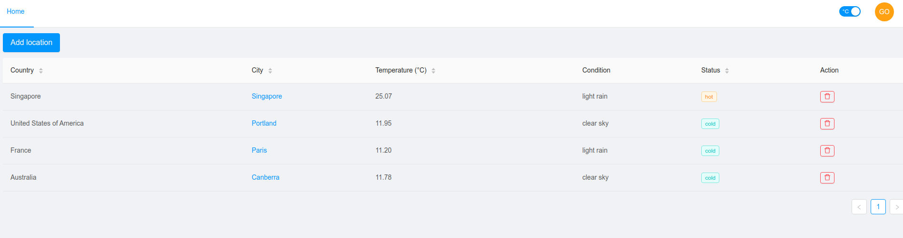
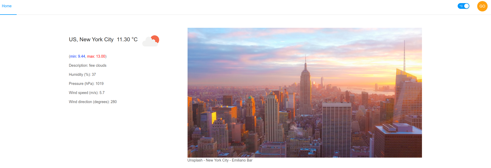

# weathered_front

This is the frontend of a weather web application. The backend can be found [here](https://github.com/romain-ngo/weathered_back).

- [weathered_front](#weatheredfront)
  - [Folder architecture](#folder-architecture)
  - [Getting started](#getting-started)
    - [Prerequisite](#prerequisite)
    - [Start](#start)
    - [Build](#build)
    - [Testing](#testing)
  - [Technology, framework and API](#technology-framework-and-api)
    - [Built with](#built-with)
    - [External API](#external-api)
  - [Images](#images)
    - [Home page](#home-page)
    - [City page](#city-page)

## Folder architecture

- node_modules: contains all the dependencies
- public: contains the root html where react will render the whole app
- src: this is the main folder containing all the source
  - components: contains all the react component
  - pages: contains the pages called by react-router
  - redux: contains the redux store, the reducers, the action creators and the action types
  - services: contains functions interacting with outside 
  - utils: contains helper function
  - App.jsx: root component
  - index.js: react entry point
- .env: contains the environment variable (/!\ **DO NOT COMMIT** /!\\)
- .gitignore: all the files that should not be committed (usually the dependencies and .env)
- package.json: npm dependency file

## Getting started

These instructions will get you a copy of the project up and running on your local machine for development and testing purposes.

### Prerequisite

1. Clone the project: `https://github.com/romain-ngo/weathered_front.git`

1. Create a `.env` file in the root folder and set the following parameters:

```
  REACT_APP_WEATHER_API_KEY="OpenWeatherMap API key"
  REACT_APP_UNSPLASH_ACCESS_KEY="Unsplash API key"
  REACT_APP_BACKEND_URL="Backend url and port (e.g. localhost:5000)"
```

`Everytime their value changes, the server must be restarted in order to be taken into account.`  
A free key can be obtained from the website of the API. (see External API section below)

3. Make sure you have npm installed. If not, it comes with [Node.js](https://nodejs.org/en/)

4. Get all the dependencies: `npm install`

### Start

1. Start the application with `npm start`. (This will start a development build, do not do this on a production environment.)

2. Go to the following URL: `localhost:3000`

### Build

In order to get an optimized production build, run the following command: `npm build`.
It will create a `build` folder, the content must be served from a web server.

### Testing

Run all tests with `npm test`

## Technology, framework and API

### Built with

- Javascript (ES6)
- create-react-app for boostraping the react project
- React for the frontend
- Redux for state management
- Antd and CSS for styling
- Leaflet for the interactive map
- Jest for unit testing

### External API

The application make use of external APIs in order to get data related to cities, weather and such.

- [OpenWeatherMap](https://openweathermap.org/api) for getting information related to the weather of a city.
- [GeoDB cities](http://geodb-cities-api.wirefreethought.com/) for searching cities coordinates (This one does not require an API key).
- [Unsplash](https://unsplash.com/developers) for the splash photo of each city.

## Images

### Home page



### City page

